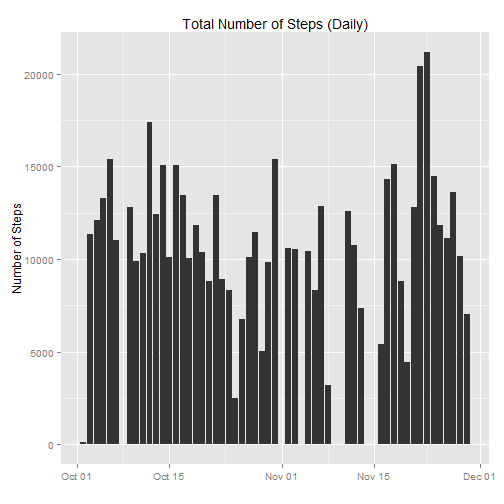
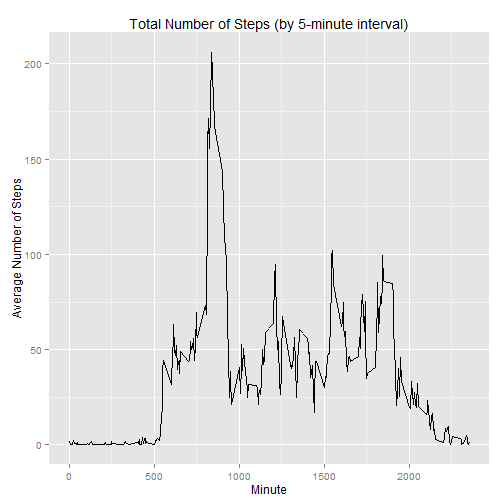
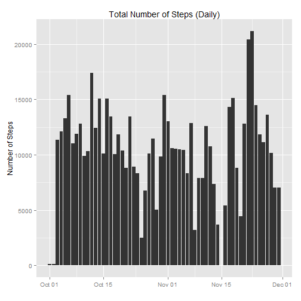
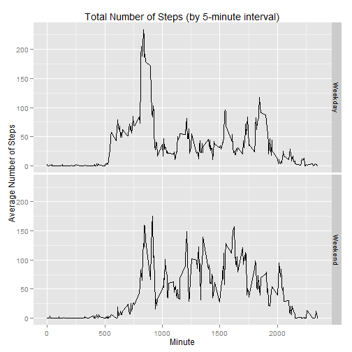

Reproducible Research: Peer Assignment Nr. 1
========================================================
This assignment steps through data analysis against Activity Monitoring Data. Please refer to the readme.md for more details and link to the raw data file.

## Loading and preprocessing the data
Loading and preprocessing the data consists of loading the data into a data frame object and performing any other processing or transformation to prepare it for data analysis.

### Load the data (i.e. read.csv())
The filename is hard coded to activity csv and the file is read into a raw data frame.

```r
file <- "./activity.csv"
rawdf <- read.csv(file)
```


### Process/transform the data (if necessary) into a format suitable for your analysis
The raw dataform is processed by cropping for only complete observations, casting the date variable into a Date class, and add a variable to assign an integer to dates for counting.

```r
rawdf$date <- as.Date(rawdf$date)
df <- rawdf[complete.cases(rawdf), ]
```


Finally, we'll be using a variety of other functions during our analysis. As such we'll have to configure the libraries.

```r
library("plyr")
library("ggplot2")
library("scales")
library("reshape2")
```


## What is mean total number of steps taken per day?
To understand the mean total number of steps taken per day, we first summarize our data based on the steps taken during each day.

```r
df2 <- ddply(df, .(date), function(x) c(stepscount = sum(x$steps)))
```

We can now answer several questions based on the summarized data frame "df2".

### Make a histogram of the total number of steps taken each day
Given how we summarized the data to be charted, we will use ggplot and the bar geom:

```r
ggplot(data = df2, aes(x = date, y = stepscount)) + geom_bar(stat = "identity") + 
    ggtitle("Total Number of Steps (Daily)") + xlab("") + ylab("Number of Steps")
```

 


### Calculate and report the mean and median total number of steps taken per day

```r
c(mean = mean(df2$steps, na.rm = TRUE), median = median(df2$steps, na.rm = TRUE))
```

```
## Warning: Name partially matched in data frame
## Warning: Name partially matched in data frame
```

```
##   mean median 
##  10766  10765
```


## What is the average daily activity pattern?

### Make a time series plot (i.e. type = "l") of the 5-minute interval (x-axis) and the average number of steps taken, averaged across all days (y-axis)

To build the time-series plot from the data frame with missing values removed ("df"):

- Summarize the data by interval

```r
df2 <- ddply(df, .(interval), function(x) c(stepsavg = mean(x$steps)))
```


- Build the plot passing the variables into x and y

```r
ggplot(data = df2, aes(x = interval, y = stepsavg)) + geom_line() + ggtitle("Total Number of Steps (by 5-minute interval)") + 
    xlab("Minute") + ylab("Average Number of Steps")
```

 


### Which 5-minute interval, on average across all the days in the dataset, contains the maximum number of steps?


```r
df2[df2$stepsavg == max(df2$stepsavg), ]$interval
```

```
## [1] 835
```


## Imputing missing values

### Calculate and report the total number of missing values in the dataset (i.e. the total number of rows with NAs)

The following calculates the number of missing values in the whole dataset:

```r
sum(is.na(rawdf))
```

```
## [1] 2304
```


### Devise a strategy for filling in all of the missing values in the dataset. The strategy does not need to be sophisticated. For example, you could use the mean/median for that day, or the mean for that 5-minute interval, etc.
+ Strategy
  - Understand which days contain missing data
  - Model the activity based on the days immediately around the day with missing data
  - Fill in the missing data:
      * If the previous and subsequent days' data is available, use the mean
      * If either the previous or subsequent day's data is available, but not both, use the available value.

+ Assumptions
  - Each day's missing data is unreliable and should be completely replaced.
  - Each surrounding day's 5 minute interval is the same activity as the day with the missing data.

### Create a new dataset that is equal to the original dataset but with the missing data filled in.

Build replacement vector through the following steps:

- Ascertain the dates where values need to be replaced (those with NA values)

```r
# step 1
rawdf2 <- rawdf
rawdf2$good <- !is.na(rawdf$steps)
quick.stats <- ddply(rawdf2, .(date, good), function(x) c(n = mean(x$steps)))
dates.NA <- as.Date(quick.stats[quick.stats$good == FALSE, ]$date)
```


- Reshape the data to map out dates by each interval.

```r
# step 2
df2 <- melt(rawdf, id = c("date", "interval"))
df2 <- dcast(df2, date ~ interval)
```


    - A sample of output can be found below:

```r
head(df2[, 1:18])
```

```
##         date  0  5 10 15 20 25 30 35 40 45 50 55 100 105 110 115 120
## 1 2012-10-01 NA NA NA NA NA NA NA NA NA NA NA NA  NA  NA  NA  NA  NA
## 2 2012-10-02  0  0  0  0  0  0  0  0  0  0  0  0   0   0   0   0   0
## 3 2012-10-03  0  0  0  0  0  0  0  0  0  0  0  0   0   0   0   0   0
## 4 2012-10-04 47  0  0  0  0  0  0  0  0  0  0  0   0   0   0   0   0
## 5 2012-10-05  0  0  0  0  0  0  0  0  0  0  0  0   0   0   0   0   0
## 6 2012-10-06  0  0  0  0  0  0  0  0  0  0  0  0   0   0   0   0   0
```


- For each date where NAs exist, perform the following:
    - For each row under analysis, determine whether the date matches our predetermined "NA" list
    - If the date matches, determine whether we can access data from the day before or after
    - Determine the reliability of the previous and following days' data by checking to see if these rows also have missing values (i.e. NA values). If NAs are found, skip over and check two days before and after.
    - Once the reliability of information from the previous and following day's data has been determined, analyze each interval (column) and replace the missing value based on the following:
        * If valid data is available the day before and after, use the mean of these to fill the missing value.
        * If valid data is only available either the day before or after, use the value.

```r
# step 3
for (date.NA in dates.NA) {
    for (row in 1:nrow(df2)) {
        if (date.NA == as.numeric(df2[row, ]$date)) {
            seeker <- 1
            if ((df2[row, ]$date - seeker) %in% dates.NA) {
                seeker.before <- 2
            } else {
                seeker.before <- 1
            }
            before <- nrow(df2[df2$date == (df2[row, ]$date - seeker.before), 
                ])
            seeker <- 1
            if ((df2[row, ]$date + seeker) %in% dates.NA) {
                seeker.after <- 2
            } else {
                seeker.after <- 1
            }
            after <- nrow(df2[df2$date == (df2[row, ]$date + seeker.after), 
                ])
            for (j in 1:ncol(df2[df2$date == df2[row, ]$date, ])) {
                if (j == 1) {
                } else {
                  if (before && !after) {
                    df2[df2$date == df2[row, ]$date, j] <- df2[df2$date == ((df2[row, 
                      ]$date) - seeker.before), j]
                  } else if (!before && after) {
                    df2[df2$date == df2[row, ]$date, j] <- df2[df2$date == ((df2[row, 
                      ]$date) + seeker.after), j]
                  } else if (before && after) {
                    df2[df2$date == df2[row, ]$date, j] <- mean(c(df2[df2$date == 
                      ((df2[row, ]$date) - seeker.before), j], df2[df2$date == 
                      ((df2[row, ]$date) + seeker.after), j]))
                  }
                }
            }
        }
    }
}
```


    - A sample of output can be found below:

```r
head(df2[, 1:18])
```

```
##         date  0 5 10 15 20 25 30 35 40 45 50 55 100 105 110 115 120
## 1 2012-10-01  0 0  0  0  0  0  0  0  0  0  0  0   0   0   0   0   0
## 2 2012-10-02  0 0  0  0  0  0  0  0  0  0  0  0   0   0   0   0   0
## 3 2012-10-03  0 0  0  0  0  0  0  0  0  0  0  0   0   0   0   0   0
## 4 2012-10-04 47 0  0  0  0  0  0  0  0  0  0  0   0   0   0   0   0
## 5 2012-10-05  0 0  0  0  0  0  0  0  0  0  0  0   0   0   0   0   0
## 6 2012-10-06  0 0  0  0  0  0  0  0  0  0  0  0   0   0   0   0   0
```


### Make a histogram of the total number of steps taken each day and Calculate and report the mean and median total number of steps taken per day. Do these values differ from the estimates from the first part of the assignment? What is the impact of imputing missing data on the estimates of the total daily number of steps?

In order to build a histogram that easily compares with the previous chart, we must make adjustments to the data - specifically:

- Sum the rows:

```r
df2$steps <- rowSums(df2[2:ncol(df2)])
```


- Transform the dataframe to only date and steps per day variables:

```r
df2 <- df2[, c(1, ncol(df2))]
```


    - We are left with the following:

```r
head(df2)
```

```
##         date steps
## 1 2012-10-01   126
## 2 2012-10-02   126
## 3 2012-10-03 11352
## 4 2012-10-04 12116
## 5 2012-10-05 13294
## 6 2012-10-06 15420
```


We can now build the graph using the same options as before:

```r
ggplot(data = df2, aes(x = date, y = steps)) + geom_bar(stat = "identity") + 
    ggtitle("Total Number of Steps (Daily)") + xlab("") + ylab("Number of Steps")
```

 


We can also calculate the mean and median as before:

```r
c(mean = mean(df2$steps, na.rm = TRUE), median = median(df2$steps, na.rm = TRUE))
```

```
##   mean median 
##  10372  10571
```


When recalculating the mean and median, we see that both values are lower now, than when the missing values were completely excluded.

## Are there differences in activity patterns between weekdays and weekends?

### Create a new factor variable in the dataset with two levels - "weekday" and "weekend" indicating whether a given date is a weekday or weekend day.

To understand the different activity patterns between weekdays and weekends, the data frame with missing values removed ("df") was repurposed. Each date was analyzed and classified as a weekday or weekend (first as boolean, then renamed to "Weekday"" or "Weekend"). The data was then summarized to group average steps by interval and type of day.

```r
weekend.List <- c("Saturday", "Sunday")
df$typeofday <- weekdays(df$date) %in% weekend.List
df$typeofday[df$typeofday == "TRUE"] <- "Weekend"
df$typeofday[df$typeofday == "FALSE"] <- "Weekday"
df2 <- ddply(df, .(interval, typeofday), function(x) c(stepsavg = mean(x$steps)))
```


    - We are left with the following:

```r
head(df2)
```

```
##   interval typeofday stepsavg
## 1        0   Weekday   2.3333
## 2        0   Weekend   0.0000
## 3        5   Weekday   0.4615
## 4        5   Weekend   0.0000
## 5       10   Weekday   0.1795
## 6       10   Weekend   0.0000
```


### Make a panel plot containing a time series plot (i.e. type = "l") of the 5-minute interval (x-axis) and the average number of steps taken, averaged across all weekday days or weekend days (y-axis).

To build the plot, we take the variables created in the new dataframe and feed them into ggplot. We add the facet grid setting to split the data by type of day (i.e. Weekday or Weekend).

```r
ggplot(data = df2, aes(x = interval, y = stepsavg)) + geom_line() + ggtitle("Total Number of Steps (by 5-minute interval)") + 
    xlab("Minute") + ylab("Average Number of Steps") + facet_grid(typeofday ~ 
    .)
```

 


---
End of document
